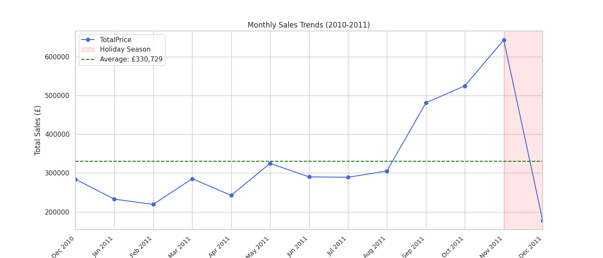
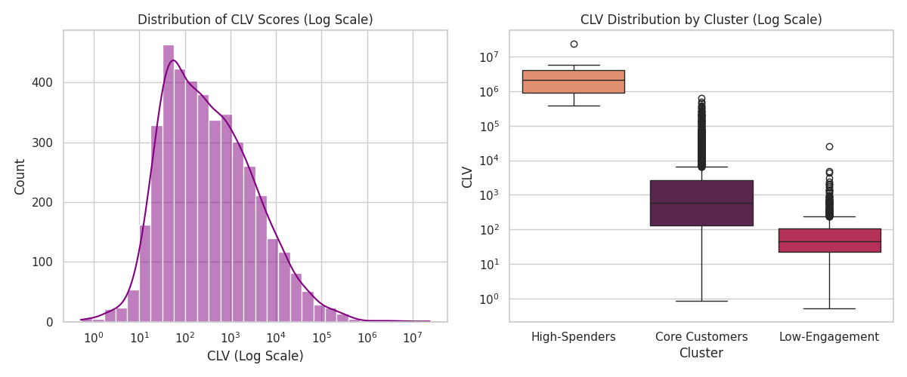
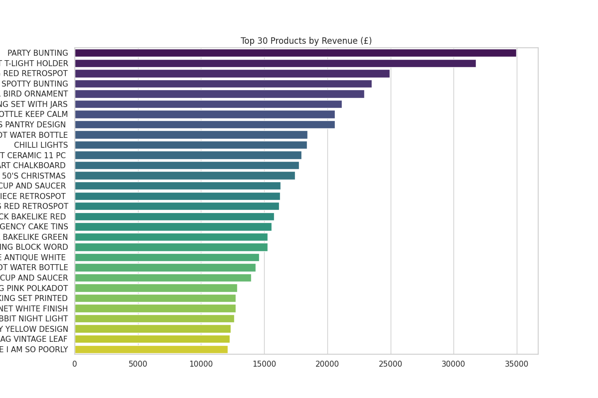

# Analyzing Customer Purchases for Key Insights

## 📌 Project Overview  
This project analyzes customer transaction data from an online retail store to uncover actionable business insights. Completed during my internship, it focuses on customer segmentation, sales pattern analysis, and CLV estimation using RFM techniques.

## 📁 Dataset  
- **Source**: [UCI Machine Learning Repository](https://archive.ics.uci.edu/ml/datasets/online+retail)  
- **Records**: 541,909 transactions  
- **Key Features**:  
  `CustomerID`, `InvoiceDate`, `Quantity`, `UnitPrice`, `Country`  

## 📊 Key Analysis Performed  

### 1. 🔧 Data Cleaning  
- Removed 135,080 rows with missing CustomerIDs  
- Eliminated 25,525 duplicate records  
- Filtered invalid transactions (Quantity ≤ 0 / UnitPrice ≤ 0)  
- Converted `InvoiceDate` to datetime format  

### 2. 📈 Exploratory Data Analysis (EDA)  
  
- **Key Statistics**:  
  - Average Transaction Value: £12.90  
  - Peak Sales Hour: 12 PM  

### 3. 🧠 Customer Segmentation (K-Means)  
  
| Segment | % Customers | % Revenue | Strategy |  
|---------|-------------|-----------|----------|  
| **Core Customers** | 73.7% | 86.1% | Retention programs |  
| **High-Spenders** | 0.2% | 6.1% | Exclusive offers |  
| **Low-Engagement** | 26.1% | 7.9% | Reactivation campaigns |  

### 4. 📦 Customer Lifetime Value (CLV)  
- **CLV Formula**: `(Frequency × Monetary) / log(Recency + 1)`  
- **Top Customer**: ID 1828 (£23.6M CLV)  

## 🖼️ Key Visualizations  
- Monthly Sales Trends:   
- Product Popularity:   
- Customer Segments:   

## 📊 Business Insights Summary  

### 🛒 Product Popularity  
**Top 3 Frequent Purchases**:  
1. WHITE HANGING HEART T-LIGHT HOLDER  
2. JUMBO BAG RED RETROSPOT  
3. PARTY BUNTING  

**Top 3 Revenue Generators**:  
1. PARTY BUNTING  
2. WHITE HANGING HEART T-LIGHT HOLDER  
3. JUMBO BAG RED RETROSPOT  

### 📅 Sales Trends  
- **Peak Sales**: November-December 2011 (Holiday Season)  
- **Monthly Average**: £330,729  
- **Key Pattern**: 45% higher sales in Q4 vs Q1  

### 👥 Customer Segmentation  
- **Core Customers**: 73.7% of customers drive 86.1% revenue  
- **High-Spenders**: 0.2% population with £23M+ CLV  
- **Low-Engagement**: 26.1% customers need reactivation  

## 🔁 Strategic Recommendations  
1. **Inventory Management**:  
   - Prioritize stock for party supplies (PARTY BUNTING) before November  
2. **Customer Retention**:  
   - Launch loyalty rewards for Core Customers  
3. **High-Value Targeting**:  
   - Create VIP bundles for top 10 High-Spenders  
4. **Reactivation Campaigns**:  
   - Send "We Miss You" discounts to Low-Engagement segment  

## 🧰 Tech Stack  
- **Python** (Pandas, NumPy)  
- **Visualization**: Matplotlib, Seaborn  
- **Clustering**: Scikit-learn (K-Means)  

## 🚀 How to Use  
```bash
# 1. Clone repository
git clone https://github.com/dhillonarman/InfoBharatDataScienceInternship.git

# 2. Run Jupyter notebook
jupyter notebook InfoBharatDataScienceInternship.ipynb
